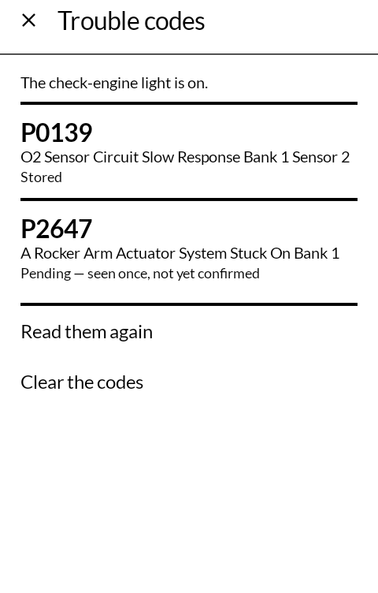
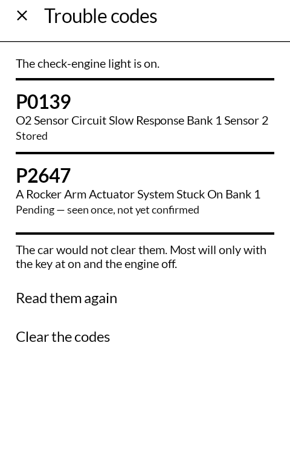
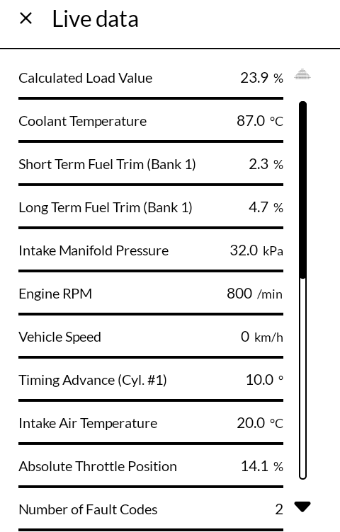
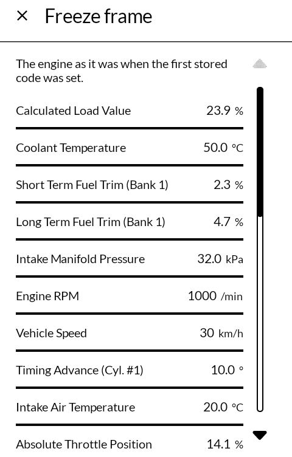

# Car Check

点検 *tenken*

What the check-engine light is on for, read from the car through a Bluetooth OBD-II adapter
— on an E Ink phone, in black and white, in words rather than symbols.

*Tenken* is an inspection: the ordinary word for going over a machine to see what is wrong
with it.

Built for the [Mudita Kompakt](https://mudita.com/products/kompakt/), whose 4.3" panel has
sixteen greys, a slow redraw, and is read in a car park as often as in a garage.

## Screenshots

| | | | |
|---|---|---|---|
|  |  |  |  |

## What it reads

- **Trouble codes**, each with its meaning and what kind it is, said in words: *stored*
  (confirmed, and lighting the lamp), *pending* (seen once, not yet confirmed), or
  *permanent* (kept by the car until it has seen for itself that the fault is gone). Whether
  the check-engine light is on is the first line.
- **Clearing the codes**, on a row you tap twice, which warns that the emissions readiness
  goes with them. If the car refuses — and most refuse with the engine running — it says
  so and why, rather than leaving the old codes on the screen as though nothing had been
  asked.
- **Live data**: engine speed, coolant, fuel trims, load, and whatever else the car
  offers, updated once a second, with the readiness monitors after them.
- **The freeze frame**: the engine as it was when the first stored code was set.
- **Vehicle information**, where the car reports it: its identity number and calibrations.

Metric or US units.

## What it needs

A **Bluetooth ELM327 adapter** — the small plug-in kind sold under a dozen names —
**paired in the phone's own Bluetooth settings** first. Most take the PIN 1234. Choose it
once in the app and it is remembered.

Classic Bluetooth only. The adapters that speak Bluetooth Low Energy, and the Wi-Fi ones,
are not supported.

It reads the diagnostics every car has had to offer since OBD-II: the standard codes and
readings. What a maker keeps for its own dealer tools — airbags, ABS, anything
manufacturer-specific beyond a code's number — is out of its reach.

## What it does not do

There is no account, no history and no network. The app holds nothing between one run and
the next except which adapter you chose and which units. What the car says stays on the
phone; see [PRIVACY.md](PRIVACY.md).

## Getting it, and keeping it

Download <https://github.com/wanderwildwood/tenken/releases/latest/download/tenken.apk> and
sideload it. That address always points at the newest release, and every release publishes a
`.sha256` beside the APK if you would rather check than trust.

For updates without doing this by hand, add this repository to
[Obtainium](https://github.com/ImranR98/Obtainium):

    https://github.com/wanderwildwood/tenken

It will offer each new release as it appears. **The application id is settled** — updates
install over what you have, keeping your settings and anything the app has stored.

## Building

```
./gradlew assembleRelease
```

A release is signed by a keystore in `signing/`, which is not in this repository. Without
it the release APK builds **unsigned** and will not install anywhere — there is no
fallback key by design.

`./gradlew :library:test :app:testDebugUnitTest` runs the tests. Most of them drive the
real protocol against a simulated ELM327 in `obd/FakeElm.kt`, which answers the way a car
with a stored code and a pending one does, and refuses the first request to clear them the
way a running engine does. Debug builds offer it as an adapter, so the whole app can be
tried on an emulator; release builds do not carry it.

## Credit

After [AndrOBD](https://github.com/fr3ts0n/AndrOBD) by fr3ts0n, whose protocol library
this carries as it is in `library/`: the ELM327 conversation, the OBD services, and the
tables of what every reading and every trouble code means, with their translations. Only
its desktop screens were left out.

The interface is a rebuild rather than a reskin: Jetpack Compose against
[MMD](https://github.com/mudita/MMD), Mudita's E Ink component library, where the original
is Android views with gauges and charts.

Icons are [Material Symbols](https://fonts.google.com/icons), Apache License 2.0.

## Licence

GNU General Public License v3.0 or later. See [LICENSE](LICENSE).

Copyright © wander wildwood.

This program incorporates AndrOBD, Copyright © fr3ts0n, whose files are licensed under the
GNU General Public License version 2 or, at your option, any later version. That grant is
not mine to narrow, so this app carries it forward as version 3 or later rather than this
shop's usual version 3 only.
